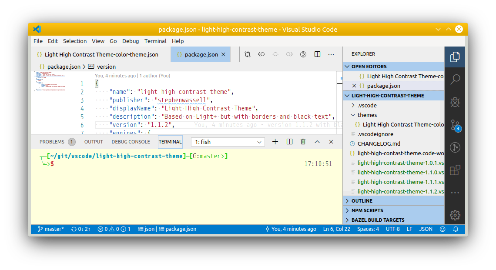

# README
Light high contrast theme

    "workbench.colorCustomizations": {
        "breadcrumb.background": "#eeeeee",
        "breadcrumb.foreground": "#000000",
        "contrastBorder": "#aaaaaa",
        "editorGroupHeader.tabsBackground":"#eeeeee",
        "foreground": "#000000",
        "input.border": "#aaaaaa",
        "panel.background": "#eeeeee",
        "panel.border": "#aaaaaa",
        "sideBar.background": "#eeeeee",
        "sideBarSectionHeader.background": "#aaccee",
        "tab.activeForeground": "#000000",
        "tab.border": "#cccccc",
        "tab.inactiveBackground": "#eeeeee",
        "tab.inactiveForeground": "#000000",
        "terminal.background": "#ffffdd",
        "terminal.foreground": "#000000",
    },
